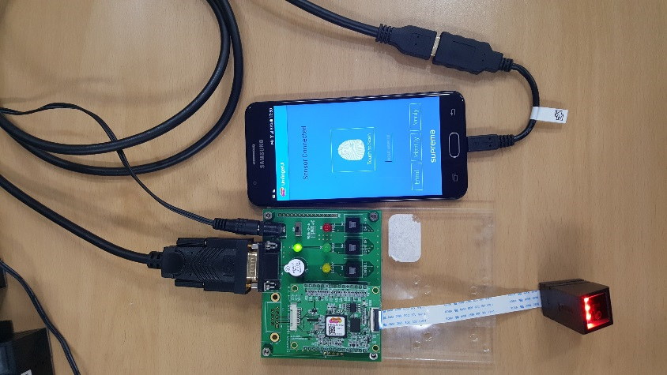

# SFM_SDK Android

This SDK is for using SFM(Suprema Fingerprint Module).
We provide all about android SFM_SDK(library, example project, document).
And you can also check more information(Other language SDK, product info, our community and etc..) through below URL.
***http://sfm.supremainc.com/***

##	Compile environment
**IDE : Android studio version -2.1.2**
**NDK : NDK version - r10e**
**SDK : Compile SDK version 22**

##	Test environment
**APK Install device : Samsung Galaxy J5(On5) prime(android 6.0.1)**
**Cables :  USB To RS232 cable : KW835(FTDI) / USB Mini 5P OTG cable**
**Test module and EVK : SFM6020,SFM5020 / SFM EVK**

